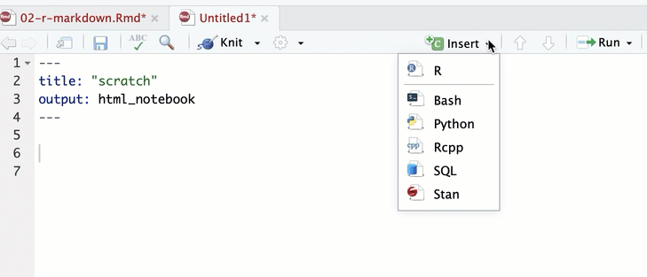
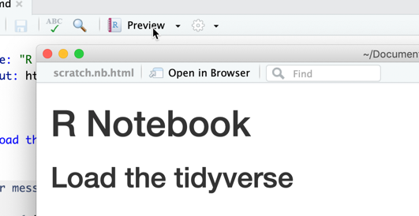

# R Markdown 

All of the work we do in class will be done through R Notebooks, which is one of the options when you create a new file. 

## Key takeaways

* Basic markdown syntax of headings and bulleted items
* Converting markdown into a readable page using Preview or Knit
* Adding and running code chunks


## Understanding Markdown

Markdown is a language that was developed to make writing simple Web pages faster and easier. Instead of coding tags, authors could use simple punctuation. This book is written using Markdown. It was created for wikis, notably Wikipedia, when it became clear that having to learn HTML as a language was a barrier to participation.  Now it's used for all kinds of static web sites hosted on Github and elsewhere. 

In R, Markdown is implemented in two ways: An R Notebook and and R Markdown document. There are a few subtle differences, but for now don't worry what they are. Just use *R Notebooks* for now. 

You must install the rmarkdown package before you can use this feature. 

      install.packages("rmarkdown")

It's automatically loaded when you start up R Studio after it's installed.


When we worked in Excel, you had to keep a detailed diary of everything you did. Otherwise, you might not have been able to reproduce it, correct it, or even explain how you got to the end. In a markdown document is self-documenting. You write code and the description in the same place. This is the note to your future self. 

### Formatting in Markdown

Markdown uses simple punctuation to create outline levels, lists, links and other elements of a page. 

This [markdown tutorial from Adam Pritchard](https://github.com/adam-p/markdown-here/wiki/Markdown-Cheatsheet) goes through the formatting rules. 

But, for example:

      ## Starting a line with ## and a space is the same as H2, or a 2nd level heading. 
       
      * A blank line, then asterisk, then space starts a bulleted list
      * This would be the second row
      

### Code chunks

So far, this is just a simple document. It doesn't contain any R code.  To add code, you insert a "code chunk".  You can add it by clicking the +Insert button at the top of the document, or by pressing *Option/Alt-Cmd-i*  Add your code in the gray area between the triple-backtic symbols.  Run the code chunk by pressing the arrow button within it, or by pressing Cmd/Ctl-Shft-Enter  (either Cmd or Ctl)

Any line that starts with a hash mark within the code chunk is a comment, and will be ignored

```{r}

#create a variable called my_data, which is one plus one
my_data <- 1  + 1 

#then print it out
my_data

```




<div style="background-color:#e6f0ff;padding:10px;">
WARNING: If you print or display a very large dataset this document will become very, very large and it will take down your computer. Try to avoid this. If you do it by mistake, delete the output and try again.
</div>


### Viewing your document

There are two choices for viewing your document in finished form: You can "knit" it, which will re-run all of the code chunks from the beginning; or you can "Preview" it, which shows you the state it's in right now. If you want the ability to do both, be sure to have these two lines at the top of your document. The difference is whether you created an R Notebook (Preview) or an R Markdown document (knit), or both.

To preview your work, choose the "Preview" or "Knit" button at the top of your program. You'll notice new files created in your home directory -- html files that were created from your code. 



      
      
## Resources

* RStudio has created a [full tutorial for R Markdown](https://rmarkdown.rstudio.com/lesson-1.html)
* Matt Waite's University of Nebraska [Sports Data journalism book](http://mattwaite.github.io/sports/the-very-basics.html#notebooks) chapter

### Exercises and assignments

* Do the first lab from Jesse Lecy's data science class at ASU: "[My First Markdown Document](https://ds4ps.org/Data-Science-Class/LABS/lab-01-instructions.html)"
* Do the lab, but include a code chunk that creates a variable.

