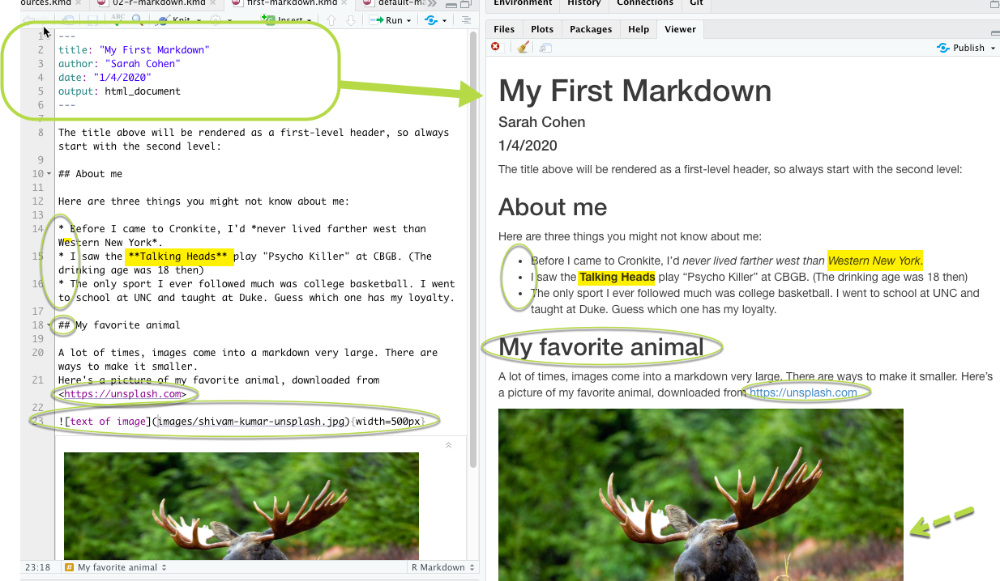
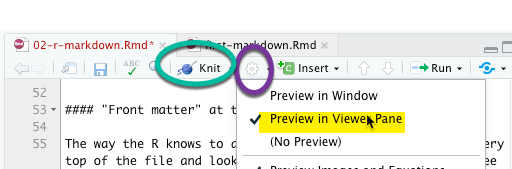

# R Markdown 

## Key takeaways

* Markdown makes documenting your work easy
* Formatting commands in Markdown: headings, links, lists and images.
* Adding and running code chunks
* Knitting your markdown into a finished document with code and results.  

## Getting started with R Markdown

Markdown was invented as an easy way for early contributors to Wikipedia to author documents that would translate to the web. It uses simple formatting rules that don't require any background in programming, HTML or CSS formatting code. This book is written using Markdown. Variants of markdown are used to create many web sites, including those hosted on Github.  

R Markdown is a slightly enhanced version of markdown. It lets you write your document around chunks of R code, which integrates your analysis with your writing. (It also lets you produce actual printed books, slides and other media.) Some news organizations do much of their internal work using R Markdown documents and code. 

You must install the rmarkdown package before you can use this feature. Install it in the Console. You only have to do this once on each computer, or in each project on rstudio.cloud: 

      install.packages("rmarkdown")

Unlike other packages, it's automatically loaded when you start up R Studio. 

## The anatomy of a document

Markdown uses simple punctuation to create outline levels, lists, links and other elements of a page. 

There are four parts to an R Markdown document: 

1. The "front matter", or YAML. 
2. Plain text with formatting indicators. 
3. Code chunks -- your R computer code.
4. The results of code chunks - what you get back when you execute the code.

The plain text follows a few basic rules. [This markdown cheatsheet from Adam Pritchard](https://github.com/adam-p/markdown-here/wiki/Markdown-Cheatsheet) goes through them, but the most common are:  

Symbol | Format | Comments
---- | ---- | ---
`#` | First level outline | usually reserved for the title
`##` | Second level outline | ... and so on
`*`  | A bulleted list item | Separate from the text by one empty line
`1`  | A numbered list |
`` | A link | `[my link words](http....)`
`` | An image link | ``
`<>` | A simple link shown as an address | `<https/cronkitedata.github...`>
`**` | Bold text |  `**This would be bold**`
`*`  | Italic text | `*This would be italic*`

#### Front matter / YAML at the top {-}

The way the R knows to do these things is by reading the very top of the file and looking at the section between the three dashes, which gives values to specific items R Markdown is expecting in a format called YAML. It's very picky about this, so if you get an error, look there for a problem. 

The good news is that the YAML is created for you when you create a new R Markdown document. When  you get more comfortable, you may want to tweak the look and feel of your document by adding parts to this section. 

    ---
    title: "Title for your page"
    author: "Sarah Cohen"
    date: "1/6/2020"
    output: html_document
    ---

## Knitting your document

Look at the top of your screen, and  you'll see a knitting needle and the word, "Knit". Pressing that button will convert your markdown into the finished document. 

Here's how it looks pre-knitted and after knitting: 

There are three reasons it might not work:

1. You haven't saved the document yet. 
2. There is an error in that top YAML section. Just copy one that works and try again. 
3. There is an error in your R code. (You'll see how to skip a chunk with an error later on.) 

I usually change one default option: I have a large screen so I like to see my document in RStudio rather than as a separate document so I don't have to flip back and forth between windows. To do that, change the options by clicking on the little gear near the knit button:

## Code chunks

So far, this is just a simple document. It doesn't contain any R code.  To add code, you insert a "code chunk".  You can add it by clicking the +Insert button at the top of the document, or by pressing *Option/Alt-Cmd-i*  Add your code in the gray area between the triple-backtic symbols.  Run the code chunk by pressing the arrow button within it, or by pressing Cmd/Ctl-Shft-Enter  (either Cmd or Ctl)

This might not seem like much, but think about how it helps you do your analysis. You can write all of your notes right where you do the work. You don't have to copy and paste information from one place to another, or share out-of-date spreadsheets with your teammates.

#### R Markdown starts from scratch {-}

Every time you close down your computer or restart R, you have to run every code chunk to get back to where you left off. This includes loading any libraries and data. This is actually good -- it ensures that your project is reproducable. But it can be confusing at first. I just knit my program as soon as I start up R each time, which takes me to where I left off. 

## Resources and exercises

### Resources {-}

* "[Data driven docs](https://ds4ps.org/docs/#what-are-data-driven-docs)" walkthrough on DS4PS (or, Data Science for the Public Sector)
* RStudio has a [quick tour of R Markdown](https://rmarkdown.rstudio.com/authoring_quick_tour.html) that goes through more than you even need. It goes a little fast. 

### Exercises {-}

Make sure you have already installed the `rmarkdown`  package before going further.

Create a new R Markdown document with the following elements: 

* Front matter with your name, the date and a title for your page.
* A heading introducing a subtopic 
* Within that heading, a list of three things about yourself or about a topic you love, in a bulleted list.
* Another heading
* An image that you like
* Another heading
* A code chunk, in which you create a variable and assign it a value.

Then knit the document and compare the sections.
