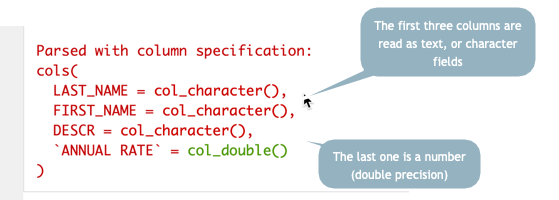

# Data frames and the tidyverse

## Key takeaways

* Loading the tidyverse 
* Reading data from from Excel or from a text file.
* Looking at your data
* Introducing the "pipe" (%>%) and a verb


```{r include=FALSE, message=FALSE}

library(tidyverse)

```

But first....


## Getting started

Every time you start up R, you will need to load any packages you intend to use. That's usually the first code chunk in your R Markdown document. If you put all of the libraries you need there, anyone you share with will know which ones have to be installed in the future. Here's how I start up a new project with a new document: 


I usually add "message=FALSE" to the r in the brackets to prevent a whole bunch of largely meaningless but scary messages. If there's a real problem, R will still let me know: 


(From now on, you'll only see the code in between the three backtics. They're invisible in the output.)


## The data frame

A data frame is an R "object", and is treated like any other variable. The difference is that it contains columns and rows, just like a spreadsheet. 

The best data frames follow the same [tidy data](https://cronkitedata.github.io/cronkite-docs/excel/xlguides/xl-tidydata.html) principles that we went over in Excel: 

* Each column contains one kind of information -- race, sex, address, etc.
* Each row contains one example of each of those columns, all at the same unit of analysis.
* Each data frame contains different levels or types of information.


### Loading and looking at data

Much of the data you use in R starts out as a CSV text file or one of its cousins. (See the [file format tutorial](https://cronkitedata.github.io/cronkite-docs/general/05-file-formats.html) if you don't remember what that is.) 

Generally, R will guess what *type* of column each one is -- number, text or date. (See the [data types tutorial](https://cronkitedata.github.io/cronkite-docs/excel/xl-tidy-data) if you forgot what that means.) There are ways to override its guess, but it's often right. 

The following code chunk: 

1. Creates a *variable* to store the long address. That makes it easier to troubleshoot or change later on.  
2. Asks the tidyverse to execute the function *read_csv* on the stored link address. The function can read files stored on the web or on your computer. 

This data is from the Phoenix open government site, and contains staff salaries as of 2018

```{r message=FALSE}

#the location on the Web for the data set's csv download
my_link <- "https://www.phoenixopendata.com/dataset/0c02bbfd-08d9-41e9-a00c-97848a9f7350/resource/3a5c2950-88e3-4cb4-b436-c78d2a266c75/download/open-data-staff-salaries-as-of-12-31-2018.csv"


#use it in a read_csv command
phx_salaries <- read_csv( my_link  )


```

When you run this code, you'll rececive a scary looking message. Don't worry - it's just giving you some information about what it found in the online file:



Notice that the column names are set automatically using the first name of the file. One of the first things you'll often want to do with a csv file is change the names using a standard style. I usually prefer lower case names with underscores between words. If I always use those, I won't have to remember which. 

The `read_csv` command, or function, is part of the tidyverse. The import functions you'll use the most are: 

    read_csv()
    read_excel()
    read_delimited()

They all work pretty much the same way on slightly different types of data files.

### Examine your data

You should now see the name of the data frame in your Global Environment. Click on it to View it, or issue the `View(phx_salaries)` command.


You can look at your data by clicking on its name in the "Global Environment" window, or by using some standard functions in R to explore them. Use the head() function to look at the top and the tail() function to look at the bottom: 

```{r results='hide'}
head(phx_salaries)

```

`r knitr::kable(head(phx_salaries, 3))`

```{r results="hide"}
tail(phx_salaries)

```

`r knitr::kable(tail(phx_salaries, 3))`

.. and use the "structure" command to see the variable names and types.

```{r}
str(phx_salaries)

```

## Introducing the pipe

<blockquote class="twitter-tweet"><p lang="en" dir="ltr">This is how I explain the &#39;pipe&#39; to <a href="https://twitter.com/hashtag/rstats?src=hash&amp;ref_src=twsrc%5Etfw">#rstats</a> newbies... <a href="https://t.co/VdAFTLzijy">pic.twitter.com/VdAFTLzijy</a></p>&mdash; We are R-Ladies (@WeAreRLadies) <a href="https://twitter.com/WeAreRLadies/status/1172576445794803713?ref_src=twsrc%5Etfw">September 13, 2019</a></blockquote> <script async src="https://platform.twitter.com/widgets.js" charset="utf-8"></script>

You'll be seeing a lot of R code that has this format: 

      data_set_name %>%
         verb ( nouns ) %>%
         verb ( nouns ) %>%
         etc...

That little symbol, `%>%` is called the "pipe". It means "and then..."

Here's a simple example with a verb called `rename`.  It takes the names of the variables from the first line, AND THEN renames them! 

This is something you often have to do because R will assume that the first row of the csv file contains the names of your variables. Using them, though, can be a pain -- you have to remember whether they're upper or lower case, and you have to put back-ticks (\`) around any names with spaces or special characters.  

Here's what using the pipe looks like to create a NEW data frame out of the old one with the names changed to lower case with underscores, a common pattern in many computer programs:


```{r echo=TRUE, results= 'hide'} 

phx_salaries_renamed <-                   #create a new data frame out of the next set of commands
   phx_salaries %>%                       #start with the original data frame name, AND THEN
   rename (  last_name=LAST_NAME,         # A list of new_name = old_name pairs, separated by commas
             first_name=FIRST_NAME,
             job_title = DESCR,
             annual_pay = `ANNUAL RATE`   #note the crazy back-ticks that you have to type for two-word names
           )                         

head (phx_salaries_renamed)    # print out the first few rows.
 
```

You can leave out any name you don't want to save. (There are fancier, faster ways to do this, but don't worry abou that just yet. This is the easiest to remember.) This code chunk results in something that looks like this: 


```{r echo=FALSE}


knitr::kable (head(phx_salaries_renamed, 3))

```

## Take a break
If you've gotten this far, congratulations -- you've started programming in R. 

I've skipped a lot of details that don't matter much right now. You'll see examples of using options and slightly different commands for the same things as we move along. But the process  of 

1) reading data into R, 
2) taking a quick look at it, and 
3) acting on it to create a new dataset 

is one you'll be doing a lot.


::: { .credit-line}
Max van den Oetelaar via Unsplash
:::

## Data frames resources

Take a look at Jesse Lecy's lesson on "[Learning How to Learn](http://ds4ps.org/dp4ss-textbook/ch-032-learning_r.html)" from his data science class at ASU. It will make you feel better, I swear. 

Hadley Wickham's "R for Data Science" [chapter on importing data](https://r4ds.had.co.nz/data-import.html) goes into a lot of the options and variants of the read_csv command. RStudio has one of its many [cheat sheets on the read_csv function](https://github.com/rstudio/cheatsheets/raw/master/data-import.pdf) and its cousins. 

Unfortunately, a lot of the other resources we've seen don't use the tidyverse versions of the import commands and they work somewhat differently. I think they'll just be confusing, since we're not dealing with the "base R" program. 

### On your own

* Start a new project in R. 
* Download [this Excel file](https://cronkitedata.github.io/cronkite-docs/assets/data/xlexamples/nea_grants.xlsx) into the folder. 
* Create an R Markdown document and document where you got the file and where it's stored. 
* Invoke two packages: the `tidyverse` and `readxl`^[You don't have to install readxl -- it's part of the tidyverse but it's not automatically activated.]
* Try importing the file into R using the `read_excel` function, which works just like `read_csv`. Take a look at its structure (`str`), its top (`head`) and its bottom (`tail`).  You've seen this data before.
* Try creating a NEW data frame from the original and rename a couple of columns.
* If you can get past the errors, knit the document and bask in the knowledge that you've come a long way. You can be quietly proud.

You will likely have some errors to puzzle through if you've never programmed anything before. Don't get discouraged -- copy and paste the code from this tutorial, and then adapt it to your needs. Try to read any error messages. 

Follow the 20-minute rule: If you have been working for 20 minutes **without ANY progress** and are out of ideas or don't understand what you're trying to do, step away from the computer. When you come back, if you're still stuck, get help on the Slack #sos channel. Be sure to say what exactly you're trying to do when you get an error and copy the code chunk and the error message.


