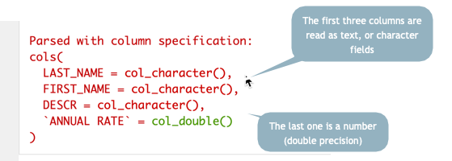
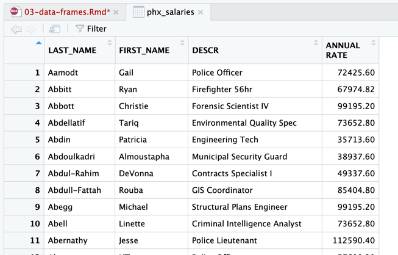

# Data frames and the tidyverse

## Key takeaways

* How to install and activate a package in R
* Activate the tidyverse every time you start using library() command
* What a data frame is
* How to read simple data from the Web or from your computer in csv form
* How to look at the data in the viewer or look at the top or bottom of the file with a command.


## Data frames

A data frame is an R "object", and is treated like any other variable. The difference is that it contains columns and rows, just like a spreadsheet. 

The best data frames follow the same [tidy data](https://cronkitedata.github.io/cronkite-docs/excel/xlguides/xl-tidydata.html) principles that we went over in Excel: 

* Each column contains one kind of information -- race, sex, address, etc.
* Each row contains one example of each of those columns, all at the same unit of analysis.
* Each data frame contains different levels or types of information.

## The tidyverse

Almost everything we do in R will be done through what's known as the tidyverse. This is a whole set of packages put together, intended to work in tandem with one another.  

At this point, if you haven't already, install the tidyverse in your Console:

      install.packages("tidyverse")


Now every time you start up an R notebook, you'll want to activate it. R notebooks don't remember where you left off, so you usually have to run all of your code chunks when you close out your work and start it up later on. When you start using more packages, or libraries, it's a good idea to have them at the beginning of your work (the "message=FALSE" part suppresses some warning messages that are scary but not very usefull whenever the tidyverse is loaded.)

```{r message=FALSE}

library(tidyverse)

```


## Loading data

Most of the time, you'll want to load in data that comes as a CSV or one of its cousins (see the [file format tutorial](https://cronkitedata.github.io/cronkite-docs/general/05-file-formats.html) if you don't remember what that is. 

Generally, R will guess what *type* of column each one is -- number, text or date. There are ways to override its guess, but it's often right. 

This command reads a CSV file that is stored on the Web rather than on  your computer. The following code chunk:

1. Creates a variable to hold the long link address, so it's easier to troubleshoot later. (It also means you can copy and paste this code into another program, and just change the link address to read something else)

2. Asks the tidyverse to execute the command read_csv on the stored link address. The "url" part tells R that it is coming from the Web rather than from a file stored on your computer. 

This data is from the Phoenix open government site, and contains staff salaries as of 2018

```{r message=FALSE}

#the location on the Web for the data set's csv download

my_link <- "https://www.phoenixopendata.com/dataset/0c02bbfd-08d9-41e9-a00c-97848a9f7350/resource/3a5c2950-88e3-4cb4-b436-c78d2a266c75/download/open-data-staff-salaries-as-of-12-31-2018.csv"


#use it in a read_csv command

phx_salaries <- read_csv(
         url(my_link)
         )


```

When you run this code, you'll rececive a scary looking message. Don't worry - it's just giving you some information about what it found in the online file:




Look at the Environment tab on the upper right, and you'll see you've created two varialbes. One is a data frame (with an arrow), the other is simple text variable. You can look at your data by clicking on its name.




### Column names

By default, R will read the first row of a CSV as the column name, which usually is a good thing. However, it's often useful to change the names using a convention that you use all the time. For me, it's lower case with a "_" separating words. Here's how to change the column names on our data, then print off a few lines of the data

```{r}
colnames (phx_salaries) <- c("last_name", "first_name", "description", "annual_rate")

# head() prints out the first 6 rows. tail() prints out the last 6.
head(phx_salaries) 

```


