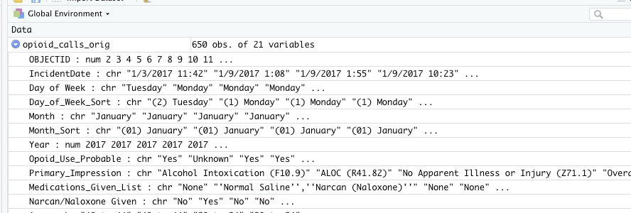
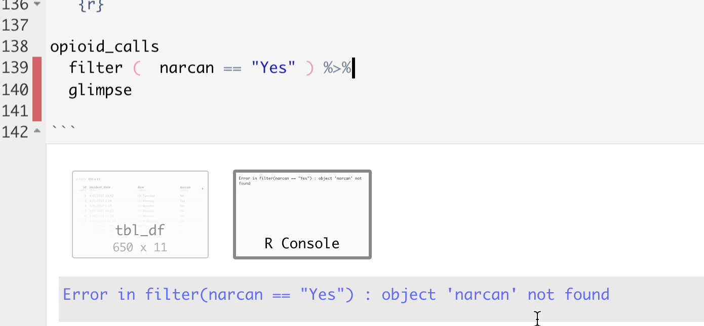

# Verbs Part 1: Picking and choosing 

## Key takeaways 

* Verb 1 -  **select**  to subset the data frame vertically (pick out / rename columns)  
* Verb 2 - **filter ** to subset the data frame horizontally (pick out rows)
* Verb 3 - **arrange** to display the data in a certain order  
* Troubleshooting common error messages


We're going to use some standard ways to pick out information from a data frame using verbs: *select* and *filter*. 

<p style="background-color:#e6f0ff;text-align:center;font-weight:bold;">
Don't forget to load the tidyverse! 
</p>


```{r message=FALSE}

library(tidyverse)


```

This tutorial uses data that was downloaded in 2019 from the Tempe, Ariz., Open data site. It's since been removed. It contains a list of opioid-related EMS calls for the city. There was virtually no documentation on the site to explain the variables. (Tempe officials have said that they are planning to republish it with less detail.)


```{r message=FALSE}

my_link <- "https://cronkitedata.github.io/cronkite-docs/assets/data/csv/opioidemscalls.csv"

#use it in a read_csv command
opioid_calls_orig <- read_csv(my_link)

```

Once read in, the dataset has 650 rows and 21 columns:



## Select - choosing columns

In Excel, we never had the opportunity of just pulling little cuts of our data vertically -- we could filter the rows, but not the columns. 

The "select" verb picks out COLUMNS of your data, and allows you to rename at the same time. 

<p style="background-color:#e6f0ff;padding:10px;"> Note that R is <b>case-sensitive</b>, meaning that the variable named <i>Age</i> is not the same thing as the variable named <i>age</i>. This is one reason rename columns using a common pattern -- you don't have to think about it again. It's also useful to remove spaces and special characters from your column names, which are difficult to reference with them. </p>


This code chunk selects only some of the variables from our original data frame and saves them in a new data frame: 

```{r}

opioid_calls <-                                    #create a new data frame, "opioid_calls"
  
    opioid_calls_orig   %>%                       #start with the old data frame  and then..
  
    select (id = OBJECTID,                        #pick out only some columns, and change their names at the same time
            incident_date =  IncidentDate,
            dow = Day_of_Week_Sort, 
            narcan = `Narcan/Naloxone Given`,       #you have to use back-ticks for special characters
            impression = Primary_Impression, 
            age  = Age,
            gender = Patient_Gender,
             asu_yn = Is_ASU_student,
             vet_yn = Is_Veteran,
             homeless_yn = Is_Homeles,
             special_population = Spec_Pop  
            )


```

Here's what it the first few rows of our selected columns looks like. (It might be chopped of on the right in your browser.)

```{r echo=FALSE}
knitr::kable(head(opioid_calls, 3)) 
```

### Selecting with shortcuts {-}

R has a lot of shortcuts so you don't have to type as much as in some other languages. You can identify columns by their position in the file, by the kind of data they hold (numbers, characters, etc.), or by the words their names contain. Here's an example:

```{r results='hide', eval=FALSE}

opioid_calls %>%
  select ( id, 
           weekday = dow,
           narcan :  gender,  #vars narcan through gender in the list 
           contains ("yn")    # has "yn" in the name
           where (is.numeric)
           ) 
   

```

In this example, we've selected the columns : 

      id
      narcan THROUGH gender in the order they appear in the data frame
      any variable that contains "yn" in its name
      any numerica column

This is super powerful when you get a dataset with tons of columns and you don't want to have to type out their names. It's also super powerful when you want to do the same thing to a bunch of similar columns. (We'll get to that later.)

## Filter - choosing rows

*Filter** is the verb you use to choose which rows are included in your output. 

Use comparison operators to choose the rows that meet certain conditions. The ones you'll usually use are:

        ==   equals 
        >    Is more than
        <    Is less than 
        %in%   Is in a list of values
        !=   does NOT equal

Connect them with logical operators, including:
        
        |    "Or" -- think of it as "this or that"
        &    "And"  -- both things must be true
        

        
**"==" isn't "=" ! You always need two equals signs for comparison. A single = sign is used to assign something to another value.**

### One filter

If you don't create a new data frame using the `<-` assignment, it will just print out on the screen. Use the "glimpse" verb to take a peek at it vertically in a way the fits on the screen.


Put the **name of the column** on the left side of the comparison, connect it with **two equal signs**, and put the value you want to look for **in quotes** on the right. The two equal signs means that it must be EXACTLY the same -- not sort of the same -- including upper and lower case.


```{r}

opioid_calls %>%
  filter (  narcan == "Yes" ) %>%
  glimpse  ()

```


In this case, you know that there were 370 rows that met your condition. It *looks* right -- all of the `narcan` items that we can see are "Yes".

### A compound filter

In Excel, you were limited in the way you could filter -- each time you picked a value from a column it was additive. That is, if you chose filters from two columns, BOTH had to be true in order to see the result. 

When you get to programming languages, you can make much more sophisticated selections using `boolean logic`, the same thing you use in filtering Google results or other types of searches. The key elements are : 

        `&` meaning AND, which  makes your net smaller so fewer fish can get in. 
        `|` meaning OR , which makes your net wider so more fish can get in.  

This can get confusing, since it's the opposite of the way we speak. When you say, "I want to see apples and oranges", you translate that into a condition that says, "Give me any row that has either apples OR oranges in the column."

(You can also reverse it by using `!` , which means - throw out all the fish I just caught, and keep the trash that got caught in the process.)

You should group your conditions together using parentheses. Here are a few examples: 

```{r eval=F, results="hide"}

opioid_calls %>%
    filter (narcan == "Yes" & asu_yn == "Yes") 

```

... every row including a `"Yes"` under narcan as well as a "Yes" under `asu_yn` . 

Adding an OR requires putting it in parentheses so that it's clear what we want. In this case, **either** asu or vets will be returned, but they have to have "narcan" . 


```{r results='hide', eval=F}

opioid_calls %>%
  filter (    narcan == "Yes" &
                 (asu_yn == "Yes" | vet_yn == "Yes"  ) 
  )  

```

#### %in% conditions {-}

Sometimes you have a lot of things from the same column that you want to pick out -- the equivalent of picking out things from the list in Excel filters. In that case, use a list that you create and the condition %in%. 

```{r results='hide'}

opioid_calls %>%
  filter (age %in% c("20 to 24", "25 to 29")) 

```

Some people find this confusing, so we can unpack that.  

* Look at the `age` column
* Create a list with two items, using the `c` for "combine" operator, with two conditions included. 
* Use the %in% operator instead of == 

This only works if the values are in the same column. 

## Arrange - change the order

"Arrange" is the equivalent of "Sort" in a spreadsheet - it's more precise in its meaning, and instructs R to re-arrange the rows of a data frame using the order identified in one or more columns. Try to piece together what this does: 

```{r results='hide'}

opioid_calls %>%
  select (dow, narcan, age, gender, asu_yn) %>%
  filter (dow %in% c("(6) Saturday", "(7) Sunday")  &
            narcan == "Yes") %>%
  arrange ( age )

```


(Reminder: the c() operator makes a list -- it combines the two quoted values into a vector.)


## Troubleshooting


When knitting or running chunks, one of the most common problems is that R will start from scratch every time you open a markdown document, or any time you try to knit it. 

That means that, for example, if you have a chunk at the top that invokes the tidyverse, you have to actually run that chunk every time you open R. Before you tear your hair out, make sure that you've run all of the chunks that you know worked before by using the `Run-> Run All Chunks Above`.  

### Importing or loading data {-}

* Have  you run the chunk at the top (the one with `library(tidyverse)`) ? If not, almost nothing that we do will work! I forget this. every. single. time.
* Is the data in the current folder or the folder you specified? Be sure to open your folder as a project, not a file, to make sure it defaults to the right place.
* Is the name of the file in quotes? It should be. 
* Have you assigned it to a new variable using the `<-` operator?
* Spelling? Remember, every piece has to be spelled properly, including any spaces or special characters in the file name. That's why you should use them when you save files. 


### Variable / object not found {-}

* Is it **spelled** correctly, including upper and lower case? 

* Are you **missing a pipe** (`%>%`) in the line above the error? It may look like this, in which R first displays the contents of the data frame called `opioid_calls`. Now it goes on to a brand new command without any data to work with, trying to filter, which is why there are two output boxes.  The fix is to put in the missing pipe, as in `opioid_calls %>%`



This will come up A LOT. The hint is to look at the line **above** the one where the error is shown -- it often is the source of the problem. 

### R is case-sensitive {-}

R is always case-sensitive, which means that it makes a difference whether an object, a column name or the value of a variable (like Male) is upper-case, lower-case or some proper case. For example:


```{r}
opioid_calls %>% 
  filter (narcan == "yes")
```

.. results in 0 cases, because narcan is shown as "Yes", not as "yes".  Instead, match the case to what you have in your data. 

### Equals versus double-equals {-}

You'll get this weird error if you try to use an equals sign as a comparison operator: 

```{r error=TRUE}
filter(opioid_calls, narcan = "Yes")

```

If you read it carefully, a the end there's hint that  R is guessing that you meant "==" instead. It won't always be so kind.

### Forgetting  "and then" operator (%>%) {-}

You also get a weird error if you forget to string together commands with  the %>% connector. 

A code chunk that looks like this: 

      filter (opioid_calls, narcan == "Yes")
           arrange (dow)


will result in the error that says, 

      Error in arrange(dow) : object 'dow' not found
      
It doesn't make much sense, except it's telling you that it is no longer finding a field called *dow*. It's done the filter and thinks it was finished because there was no AND THEN connector. Then it tries to run another command, but it's starting from scratch without a data frame to work from.  

This is really common and a pain. R thought you had TWO things you wanted to do -- one is just the filter, the other  is an error. The fix is to put the %>% after the filter.

#### Spelling {-}

Everything has to be spelled the way R expects it to be, not the way it should be. If a variable name is misspelled, it has to be misspelled every time you use it until you change the name. 


#### Spelling {-}

Just again. Spelling. 


### The dreaded `NA` {-}

Missing information is recorded in R as `NA`. The problem is, this isn't a value at all -- it will never match anything, will never be bigger or smaller than anything, and will be ignored if you sort on it. We'll come back to this, but just remember that it's a problem.


## Sort / filter resources

### Exercises

In "[The Serial Killer Detector](https://www.newyorker.com/magazine/2017/11/27/the-serial-killer-detector)", the New Yorker profiles how Tom  Hargrove spent years creating more complete murder data than the government has available. I have taken the data from that project and converted it into an R data object that includes only murders in the West. The appendix to this book has exercises using that data using skills that were outlined in each chapter. 

### Tutorials

Most tutorials on this topic go through all of the basic verbs, including some you haven't seen yet (such as group_by, summarise and mutate). They all go together, but we'll be doing them a little at a time. Don't worry if these resources touch on things you don't know yet. 

* "[Teaching R](https://teachingr.com/)" videos. They're a little more detailed than we need, but it's a useful review of most of what we've done. 
* Andrew Ba Tran's "[Lesson 3: Wrangling data](https://learn.r-journalism.com/en/wrangling/)" from the R for Journalists (learn-r) website. You can watch the videos and take the quizzes without following along on your computer. 
* Matt Waite's [chapter on filters](http://mattwaite.github.io/sports/filters-and-selections.html) -- note that it has a verb we haven't looked at yet, called "mutate"
* Data School "[Faster data manipulation with dplyr](https://www.dataschool.io/dplyr-tutorial-for-faster-data-manipulation-in-r/)", which is a little more in-depth than we need but is easy to follow. 

 