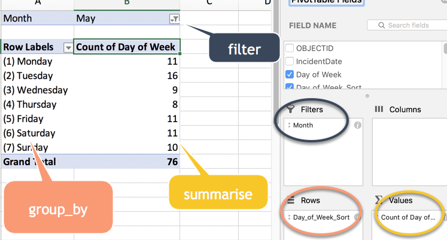

```{r setup, include=FALSE}
knitr::opts_chunk$set(echo = TRUE)
```

We've read the Serial Killer Detective from the New Yorker in class. The project makes the dataset public, and Andrew Ba Tran uses the entire country's data in his online course at [R for Journalists](https://learn.r-journalism.com/en/). I've taken that dataset, made it a little simpler and pulled out just the Arizona cases. 


NOTE: My apologies -- This dataset has slightly different variable names and types than the one we worked with in filtering. I'll go back and try to fix it but don't be surprised if it's just a little different. For example, I don't have the weapon or relationship codes in this one.

As always, load the tidyverse

```{r message=FALSE}

library(tidyverse)

```


And load a dataset saved in native R format from our course website: 

```{r}


load (url("https://cronkitedata.github.io/cronkite-docs/assets/data/r-data/murders.Rda"))

#print out the structure of the dataset
str(murders)


```


## group_by / summarise () verbs

Group_by and summarise () almost always go together, the way that a pivot always has one element in the row or column area, and another element that produces the numbers in middle. In fact, almost everything we've done so far has a corrollary in an Excel data sheet or pivot table: 



### Summarizing data with group_by

Group by is used when you want to answer questions that start with "How many?" and "How much?" . They *summarize* your data to a new unit of analysis that is more general than the data you started with. 

Think of it as making piles of cards by suit, or gathering together all the red M&Ms, all the brown ones, and all the other colors into their own little areas, then counting up how many are in each pile. 

A group by statement is almost always followed by a "summarise" (British spelling) statement, that supplies the *number* you want to calculate. Give the number a name you'll recognize later so that it's easy to refer back to:

          summarise ( number_of_items =  n () ,
                      total_amount = sum ( my_variable, na.rm = TRUE), 
                      number_of_unique_items = n_distinct (my_variable) )
          
You can also get the minimum value, maximum value, average, median, etc. One advantage of R over Excel is that you can get medians by groups in R -- something that's quite difficult in Excel. 


One common task is to look at which categories are largest in a dataset: 

```{r}

murders %>%
  group_by ( weapon ) %>%
  summarise ( num_of_murders = n() ) %>%
  arrange  ( desc(num_of_murders) )

```


You can group by more than one variable.  For instance, I may want to look at weapon useage by state:

```{r}

murders %>%
  group_by (weapon,  state) %>%
  summarise (num_of_murders = n() )  %>%
  arrange ( weapon, state )


```

 
### Another example: by state

Here are some other examples of data you can calculate, this time by state : 

```{r}

murders %>%
  group_by (state) %>%
  summarise (num_of_murders = n() ,
             num_of_agencies = n_distinct (agency),
             first_murder = min(year) ,
             last_murder = max(year),
             avg_victim_age = mean(victim_age, na.rm=TRUE)
             )

```


### Optional: Subtotals

R has powerful ways to look at data with group by commands, including calculating subtotals from a grouped query. Here's an example, in which we calculate the total number of murders next to the murder by weapon: 

```{r}

murders %>%
  group_by (state, weapon) %>%
  summarise (num_of_murders = n() ) %>%
  # this is a new verb you haven't seen yet! 
  mutate  ( num_murders_in_state  = sum(num_of_murders) ) %>% 
  arrange ( weapon)

```
