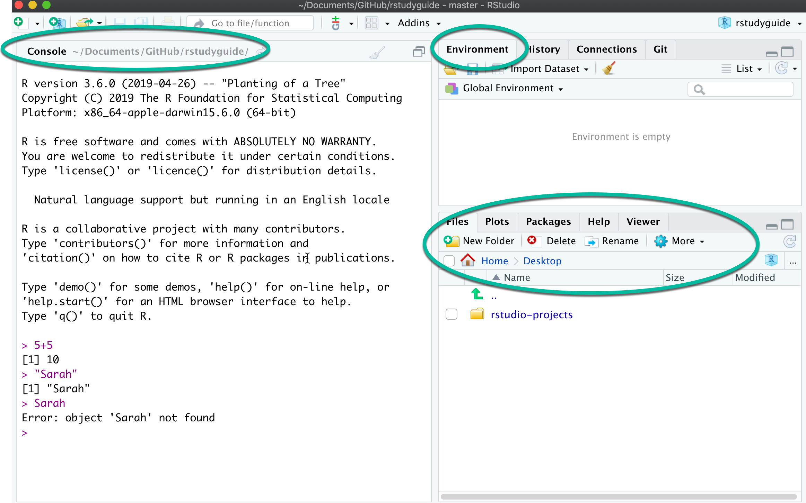
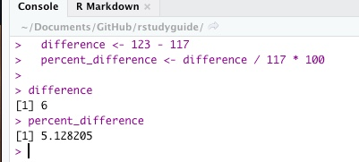

# (PART) Introduction to R for Journalists {-}

# An R and R Studio tour {#rstudio-tour}

## Key takeaways

* The benefits of learning a programming language
* Accessing R and RStudio on the cloud, or installing it on your computer
* Distinguishing the programming language R from the way you interact with it, RStudio.
* Getting accustomed to the RStudio screen. 
* Interacting with the Console
* Understanding, installing and invoking packages. 
* Storing values in variables for later use.

## Why program?

All programming languages have one thing in common: You write instructions, called algorithms, and the program executes your statements in order. It means you can do more complicated work in computer programming than in point-and-click parts of Excel. 

It can also scale -- you can repeat your instructions millions of times, tweak it a little, and re-run the program without messing anything else up. The computer won't mind -- really.

Finally, writing code can be self-documenting. You can largely eliminate those painstaking Excel data diaries and replace them with documents that explain your work as you go. You'll still need to record information about your interviews and decisions, but you'll no longer have to write down every mouse click. 


#### Why R? {-}

It's free and open source -- you will be able to get access to most of what R has to offer without ever paying for a service or a piece of software. 

More importantly, R has become the de facto tool for statistical and data analysis in many newsrooms and academic settings. Some news organizations strongly prefer interns and entry level data reporters who have at least a little experience with the language. There's also a huge user base, with many people willing and even eager to help newcomers. 

R also has extensions, called packages, that cover most tasks you need as a reporter. Other lanugagees like Python can also be extended this way -- choosing which one to use is largely a matter of taste and comfort. Many employers don't care which programming language you know because it's relatively easy to learn another once you're comfortable with the concepts.

## Setting up R and R Studio 

Andrew Heiss, who teaches BYU's Data Science for Public management, has [a detailed walkthrough](https://statsf18.classes.andrewheiss.com/install/) on getting access to R and R Studio. This is the short version.

#### RStudio Cloud {-}

The very easiest approach to getting most everything you need is to sign up for a [free account on RStudio Cloud](https://rstudio.cloud). You'll use the program through your web browser instead of putting it on your computer. It's nearly identical to the program you'd run on your laptop. 

It can be a little slow to start up, and it can crash every once in a while. Be patient, careful and **save often**.  

#### Install yourself {-}

If you want to install on your laptop, try these steps. You'll have to be an administrator allowed to install software on your computer, for it to work.

**MAC users only:** 

To get R Studio to work properly, your computer should have command line tools installed. These aren't installed by default in Apple's operating system. This is a pain, but you only need to do it once. You'll get annoying errors in R Studio if you don't do this.

Open up a terminal window, found in your Applications folder under Utilities. First, check to see if it's already installed by typing `xcode-select -p`. If it replies with a path to a folder, you can skip this part --  you already have it. 

If not, type `xcode-select --install`. You'll get an error message saying that it can't be done because you don't have command line tools, and would you  like to install them now? Say yes. Once it's done, just close out your terminal. You never wanted that thing you asked to install in the first place. 

**Everyone**:

* Download and install [R for your computer](https://rweb.crmda.ku.edu/cran/). Use the most recent binaries for your operating system.

* Install [R Studio Desktop](https://www.rstudio.com/products/rstudio/download/#download) for your computer ONLY AFTER YOU HAVE INSTALLED R. Use the free community version.

## An R Studio tour

 
Now you're ready to start using R and R Studio. R is the underlying programming language, which you will probably never use on its own. R Studio is an interface to that language that helps you organize projects, write code, see your results and keep track of your work.   

Fire up R Studio, not the R language to get started.




### The Console 

The Console is where you can type commands and interact directly with the programming language. Think of it as a very powerful calculator at first.


When you type this: `5+5` after the > prompt, you'll get this back:
``[1] 10``

When you type this: `"Sarah"` (with quotes) after the > prompt, you'll get this back:
``[1] "Sarah"``

But if you type this: `Sarah` (without quotes)  after the > prompt, you'll get this error: `Error: object 'Sarah' not found`. That's because it thinks you want to use a variable named Sarah, not the literal letters S-a-r-a-h


### Work in projects 


One of the things that trips up new users of R is that it's hard to tell the program where to find things on your computer. The "working directory" can be confusing. 


One way to get around that is to always work in projects. Projects in R isolate your work in a single folder, which can be transferred from computer to computer without worrying about what's missing.  If you're using RStudio.cloud, every project is already self-contained.

Instead of creating a new file when you start R, create a new project, and tell R where to put the directory when prompted.  

Then, when you want to return to the project, open the project rather than a file. 

## Unlocking packages

The real power of R comes with packages. Packages are bundles of programs that others have found useful to extend the base R language. R is almost useless without them. There are thousands of packages available for R, each doing a special job.

As a general rule of thumb, install packages using the console. They must be installed once on every computer, or in every project when you use RStudio Cloud.  Activate them using the `library()` command

    install.packages("tidyverse")     # quoted, only do this once in the Console
    library(tidyverse)                # not quoted, every time in your program


#### Packages for this class {-}

Using the Console, install the packages we need for class: 


```r
install.packages("tidyverse")  
install.packages("rmarkdown")
install.packages("swirl")
```


#### A quick note on the tidyverse {-}

Almost all of the materials you see related to programming in R have some reference to this thing called the "tidyverse". One problem with having a lot of packages, often written by hobbyists,  is that they're not very consistent. One might use a comma where another uses some dots, for example. 

The tidyverse packages up a whole set of other packages that are designed to work together smoothly with similar grammar and syntax. It's particularly useful for the kind of work reporters do -- importing, cleaning and analyzing data that we get from others and can't control how it's structured. 

For many reporters (myself included), R was too difficult to learn before the tidyverse came around. We'll be working almost exclusively within the tidyverse in this course. 

The tidyverse is the brainchild of [Hadley Wickham](http://hadley.nz/), a statistician from New Zealand, who famously identified the [tidy data principles](https://cronkitedata.github.io/cronkite-docs/excel/xlguides/xl-tidydata)  we've followed all semester. He's currently the chief data scientist for RStudio in Houston.


## Variables

A variable is a container for a value, a list or some other kind of object. At its simplest, it might hold a number or a word. To make a variable, use the assignment operator: `<-` . Think of it as a value being pushed into a name: 

    my_variable <- 13

When you hit the return button, nothing happens. Instead of printing it, it's stored it in a variable and it's added to your Global Environment pane. Now you can use the name instead of the value.


#### Using variables in new variables {-}

You can always use a variable you already computed to calculate something new: 



#### Working with lists {-}

One of the most powerful characteristics of a programming language is that it lets you work on a whole set of values at once, usually through a list. In R, they're called vectors. Think of them as the values in a column of a spreadsheet. 

Create a vector with the `c` operator, short for "combine":

      c( "me", "you", "everyone")
      c( 1, 2, 3)

In most contexts, they have to all be the same data type.


## Resources and exercises

Before you move on in this book, you should make sure that you have a way to get RStudio, either on your computer or on RStudio Cloud, and that it's installed properly. 

#### Take the swirl() tutorial {-}

If you haven't done it already, install the swirl() package. Do this in the Console: `install.packages("swirl")`

Once it's installed, activate it using the library command and start it up.

        library(swirl)
        swirl()

Then just follow the prompts. Don't worry that they're red -- it doesn't mean there's anything wrong. You should do the first section of the first chapter:  "1: R Programming: The basics of programming in R" ->  "Basic Building Blocks". At the end,  hit the escape key.

### Googling for help

There are a few tricks to getting a good Google answer. First, set the time frame for the answer to the last year. It doesn't always work, but at least you're trying to get more recent answers. R has changed A LOT over the last 3-5 years. You don't want to get bogged down in the "old" way. 

Add the name of any package you're using. If you aren't sure which one is tripping you up, just add the word "tidyverse" to the query. That will get you closer.


#### Other resources {-}

Sharon Machlis' [Practical R for Mass Communications and Journalism](http://www.machlis.com/R4Journalists/a-brief-introduction-to-rstudio.html) has an intro to R and R Studio beginning in chapter 2.3


Ben Stenhaug created a fast-paced video introducing the R Studio interface. Don't worry too much about what some of it means just yet -- just see if you can get used to the different parts of the screen. 

<iframe width="560" height="315" src="https://www.youtube.com/embed/lTTJPRwnONE" frameborder="0" allow="accelerometer; encrypted-media; gyroscope; picture-in-picture" allowfullscreen></iframe>


