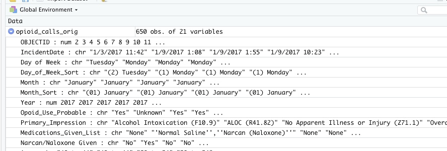

# Verbs Part 1: Picking and choosing 

## Key takeaways 

* Verb 1 -  **select**  to subset the data frame vertically (pick out / rename columns)  
* Verb 2 - **filter ** to subset the data frame horizontally (pick out rows)
* Verb 3 - **arrange** to display the data in a certain order  
* Troubleshooting common error messages


We're going to use some standard ways to pick out information from a data frame using verbs: *select* and *filter*. 

<p style="background-color:#e6f0ff;text-align:center;font-weight:bold;">
Don't forget to load the tidyverse! 
</p>


```r
library(tidyverse)
```

This tutorial uses data that was downloaded in 2019 from the Tempe, Ariz., Open data site. It's since been removed. It contains a list of opioid-related EMS calls for the city. There was virtually no documentation on the site to explain the variables. (Tempe officials have said that they are planning to republish it with less detail.)


```r
my_link <- "https://cronkitedata.github.io/cronkite-docs/assets/data/csv/opioidemscalls.csv"

#use it in a read_csv command
opioid_calls_orig <- read_csv(my_link)
```

Once read in, the dataset has 650 rows and 21 columns:



## Select - choosing columns

In Excel, we never had the opportunity of just pulling little cuts of our data vertically -- we could filter the rows, but not the columns. 

The "select" verb picks out COLUMNS of your data, and allows you to rename at the same time. 

<p style="background-color:#e6f0ff;padding:10px;"> Note that R is <b>case-sensitive</b>, meaning that the variable named <i>Age</i> is not the same thing as the variable named <i>age</i>. This is one reason rename columns using a common pattern -- you don't have to think about it again. It's also useful to remove spaces and special characters from your column names, which are difficult to reference with them. </p>


This code chunk selects only some of the variables from our original data frame and saves them in a new data frame: 


```r
opioid_calls <-                                    #create a new data frame, "opioid_calls"
  
    opioid_calls_orig   %>%                       #start with the old data frame  and then..
  
    select (id = OBJECTID,                        #pick out only some columns, and change their names at the same time
            incident_date =  IncidentDate,
            dow = Day_of_Week_Sort, 
            narcan = `Narcan/Naloxone Given`,       #you have to use back-ticks for special characters
            impression = Primary_Impression, 
            age  = Age,
            gender = Patient_Gender,
             asu_yn = Is_ASU_student,
             vet_yn = Is_Veteran,
             homeless_yn = Is_Homeles,
             special_population = Spec_Pop  
            )
```

Here's what it the first few rows of our selected columns looks like. (It might be chopped of on the right in your browser.)


 id  incident_date    dow           narcan   impression                              age        gender   asu_yn   vet_yn   homeless_yn   special_population 
---  ---------------  ------------  -------  --------------------------------------  ---------  -------  -------  -------  ------------  -------------------
  2  1/3/2017 11:42   (2) Tuesday   No       Alcohol Intoxication (F10.9)            40 to 44   Female   No       No       No            No                 
  3  1/9/2017 1:08    (1) Monday    Yes      ALOC (R41.82)                           40 to 44   Male     No       No       No            No                 
  4  1/9/2017 1:55    (1) Monday    No       No Apparent Illness or Injury (Z71.1)   20 to 24   Male     No       No       Yes           Homeless           

### Optional: Other ways to select {-}

R has a lot of shortcuts so you don't have to type as much as in some other languages. You can identify columns by their position in the file, by the kind of data they hold (numbers, characters, etc.), or by the words their names contain. Here's an example:


```r
opioid_calls %>%
  select ( id, 
           weekday = dow,
           narcan :  gender,  #vars narcan through gender in the list 
           contains ("yn")    # has "yn" in the name
           ) 
```


## Filter - choosing rows

*Filter** is the verb you use to choose which rows are included in your output. 

Use comparison operators to choose the rows that meet certain conditions. The ones you'll usually use are:

        ==   equals 
        >    Is more than
        <    Is less than 
        %in%   Is in a list of values
        !=   does NOT equal

Connect them with logical operators, including:
        
        |    "Or" -- think of it as "this or that"
        &    "And"  -- both things must be true
        

        
**"==" isn't "=" ! You always need two equals signs for comparison. A single = sign is used to assign something to another value.**

### One filter

If you don't create a new data frame using the `<-` assignment, it will just print out on the screen. Use the "glimpse" verb to take a peek at it vertically in a way the fits on the screen.


Put the name of the column on the left side of the comparison, connect it with two equal signs, and put the value you want to look for (in quotes if it's text) on the right. The two equal signs means that it must be EXACTLY the same -- not sort of the same -- including upper and lower case.


```r
opioid_calls %>%
  filter (  narcan == "Yes" ) %>%
  glimpse  
```

```
## Observations: 370
## Variables: 11
## $ id                 <dbl> 3, 7, 11, 12, 13, 18, 20, 21, 25, 29, 30, 34,…
## $ incident_date      <chr> "1/9/2017 1:08", "1/11/2017 11:10", "1/14/201…
## $ dow                <chr> "(1) Monday", "(3) Wednesday", "(6) Saturday"…
## $ narcan             <chr> "Yes", "Yes", "Yes", "Yes", "Yes", "Yes", "Ye…
## $ impression         <chr> "ALOC (R41.82)", "ALOC (R41.82)", "ALOC (R41.…
## $ age                <chr> "40 to 44", "80 to 84", "35 to 39", "40 to 44…
## $ gender             <chr> "Male", "Male", "Female", "Male", "Male", "Ma…
## $ asu_yn             <chr> "No", "No", "No", "No", "No", "Unknown", "No"…
## $ vet_yn             <chr> "No", "No", "No", "No", "No", "Unknown", "No"…
## $ homeless_yn        <chr> "No", "No", "No", "No", "No", "Unknown", "No"…
## $ special_population <chr> "No", "No", "No", "No", "No", "Unknown", "No"…
```

Here are the pieces of that function: 


In this case, you know that there were 370 rows that met your condition. It *looks* right -- all of the `narcan` items that we can see are "Yes".

### A compound filter

Filter for more than one condition that must be true using the "and" operator: &.  


```r
opioid_calls %>%
    filter (narcan == "Yes" & asu_yn == "Yes") 
```

### Even more compound filters

#### OR conditions {-}

Say we want either asu OR veterans who got Narcan. Here's a query that combines the **and** (&) condition with an **or** (|) condition: 


```r
opioid_calls %>%
  filter (    narcan == "Yes" &
                 (asu_yn == "Yes" | vet_yn == "Yes"  ) 
  )  
```

#### %in% conditions {-}

Use the operator %in% when you want to pick among several possible answers. Say I want to look at anyone aged 20 to 29. Instead of "or", I can use %in% because it's only one column:


```r
opioid_calls %>%
  filter (age %in% c("20 to 24", "25 to 29")) 
```

## Arrange - change the order

"Arrange" is the equivalent of "Sort" in a spreadsheet - it's more precise in its meaning, and instructs R to re-arrange the rows of a data frame using the order identified in one or more columns. Try to piece together what this does: 


```r
opioid_calls %>%
  select (dow, narcan, age, gender, asu_yn) %>%
  filter (dow %in% c("(6) Saturday", "(7) Sunday")  &
            narcan == "Yes") %>%
  arrange ( age )
```

<div class="kable-table">

dow            narcan   age        gender                          asu_yn  
-------------  -------  ---------  ------------------------------  --------
(7) Sunday     Yes      15 to 19   Male                            Unknown 
(7) Sunday     Yes      15 to 19   Male                            Yes     
(6) Saturday   Yes      15 to 19   Male                            No      
(6) Saturday   Yes      15 to 19   Female                          Unknown 
(6) Saturday   Yes      15 to 19   Male                            No      
(7) Sunday     Yes      15 to 19   Female                          Unknown 
(6) Saturday   Yes      15 to 19   Female                          Unknown 
(7) Sunday     Yes      15 to 19   Male                            No      
(6) Saturday   Yes      15 to 19   Female                          No      
(6) Saturday   Yes      20 to 24   Female                          Unknown 
(7) Sunday     Yes      20 to 24   Male                            No      
(6) Saturday   Yes      20 to 24   Male                            No      
(7) Sunday     Yes      20 to 24   Female                          Unknown 
(6) Saturday   Yes      20 to 24   Male                            Unknown 
(6) Saturday   Yes      20 to 24   Male                            No      
(6) Saturday   Yes      20 to 24   Male                            Unknown 
(7) Sunday     Yes      20 to 24   Male                            No      
(6) Saturday   Yes      20 to 24   Male                            No      
(6) Saturday   Yes      20 to 24   Female                          No      
(6) Saturday   Yes      20 to 24   Male                            No      
(6) Saturday   Yes      20 to 24   Male                            Yes     
(6) Saturday   Yes      20 to 24   Male                            No      
(7) Sunday     Yes      20 to 24   Female                          Unknown 
(7) Sunday     Yes      20 to 24   Female                          Unknown 
(6) Saturday   Yes      20 to 24   Male                            No      
(7) Sunday     Yes      20 to 24   Female                          No      
(7) Sunday     Yes      25 to 29   Female                          No      
(7) Sunday     Yes      25 to 29   Female                          Unknown 
(6) Saturday   Yes      25 to 29   Female                          Unknown 
(7) Sunday     Yes      25 to 29   Female                          No      
(7) Sunday     Yes      25 to 29   Female                          No      
(6) Saturday   Yes      25 to 29   Male                            Unknown 
(6) Saturday   Yes      25 to 29   Male                            Unknown 
(7) Sunday     Yes      25 to 29   Female                          No      
(6) Saturday   Yes      25 to 29   Male                            Unknown 
(7) Sunday     Yes      25 to 29   Male                            No      
(6) Saturday   Yes      25 to 29   Male                            Unknown 
(6) Saturday   Yes      25 to 29   Male                            No      
(6) Saturday   Yes      25 to 29   Female                          No      
(6) Saturday   Yes      25 to 29   Male                            No      
(7) Sunday     Yes      25 to 29   Male                            No      
(7) Sunday     Yes      25 to 29   Male                            No      
(7) Sunday     Yes      25 to 29   Female                          No      
(6) Saturday   Yes      25 to 29   Male                            No      
(7) Sunday     Yes      25 to 29   Male                            No      
(6) Saturday   Yes      25 to 29   Male                            No      
(6) Saturday   Yes      25 to 29   Male                            No      
(7) Sunday     Yes      25 to 29   Female                          No      
(6) Saturday   Yes      25 to 29   Male                            No      
(7) Sunday     Yes      25 to 29   Male                            No      
(7) Sunday     Yes      25 to 29   Male                            Unknown 
(7) Sunday     Yes      25 to 29   Male                            Unknown 
(7) Sunday     Yes      30 to 34   Male                            Unknown 
(6) Saturday   Yes      30 to 34   Male                            Unknown 
(6) Saturday   Yes      30 to 34   Male                            No      
(7) Sunday     Yes      30 to 34   Male                            No      
(6) Saturday   Yes      30 to 34   Female                          No      
(7) Sunday     Yes      30 to 34   Male                            No      
(6) Saturday   Yes      30 to 34   Male                            No      
(7) Sunday     Yes      30 to 34   Female                          No      
(7) Sunday     Yes      30 to 34   Male                            No      
(6) Saturday   Yes      30 to 34   Male                            No      
(6) Saturday   Yes      35 to 39   Female                          No      
(7) Sunday     Yes      35 to 39   Female                          No      
(7) Sunday     Yes      35 to 39   Male                            Unknown 
(6) Saturday   Yes      35 to 39   Male                            No      
(7) Sunday     Yes      35 to 39   Male                            No      
(7) Sunday     Yes      35 to 39   Unknown (Unable to Determine)   No      
(6) Saturday   Yes      35 to 39   Male                            Unknown 
(6) Saturday   Yes      35 to 39   Male                            No      
(6) Saturday   Yes      35 to 39   Female                          No      
(7) Sunday     Yes      35 to 39   Female                          No      
(7) Sunday     Yes      40 to 44   Male                            No      
(6) Saturday   Yes      40 to 44   Male                            No      
(7) Sunday     Yes      40 to 44   Female                          No      
(7) Sunday     Yes      40 to 44   Male                            No      
(6) Saturday   Yes      40 to 44   Male                            No      
(6) Saturday   Yes      40 to 44   Male                            Unknown 
(7) Sunday     Yes      40 to 44   Male                            Unknown 
(7) Sunday     Yes      40 to 44   Female                          No      
(6) Saturday   Yes      40 to 44   Male                            No      
(6) Saturday   Yes      40 to 44   Male                            N/A     
(6) Saturday   Yes      40 to 44   Female                          No      
(7) Sunday     Yes      45 to 49   Female                          No      
(7) Sunday     Yes      45 to 49   Female                          No      
(6) Saturday   Yes      45 to 49   Female                          No      
(6) Saturday   Yes      45 to 49   Male                            Unknown 
(7) Sunday     Yes      45 to 49   Female                          No      
(6) Saturday   Yes      45 to 49   Female                          No      
(6) Saturday   Yes      45 to 49   Male                            Unknown 
(7) Sunday     Yes      45 to 49   Male                            No      
(6) Saturday   Yes      45 to 49   Male                            Unknown 
(7) Sunday     Yes      50 to 54   N/A                             No      
(7) Sunday     Yes      50 to 54   Male                            Unknown 
(6) Saturday   Yes      50 to 54   Female                          Unknown 
(6) Saturday   Yes      50 to 54   Male                            No      
(7) Sunday     Yes      50 to 54   Female                          No      
(7) Sunday     Yes      50 to 54   Female                          No      
(7) Sunday     Yes      55 to 59   Male                            No      
(6) Saturday   Yes      55 to 59   Male                            Unknown 
(6) Saturday   Yes      55 to 59   Male                            No      
(7) Sunday     Yes      55 to 59   Male                            No      
(7) Sunday     Yes      60 to 64   Male                            No      
(6) Saturday   Yes      60 to 64   Male                            No      
(7) Sunday     Yes      60 to 64   Male                            No      
(7) Sunday     Yes      60 to 64   Male                            No      
(6) Saturday   Yes      60 to 64   Female                          No      
(7) Sunday     Yes      60 to 64   Female                          Unknown 
(7) Sunday     Yes      65 to 69   Male                            No      
(7) Sunday     Yes      65 to 69   Male                            Unknown 
(6) Saturday   Yes      70 to 74   Female                          No      
(6) Saturday   Yes      70 to 74   Female                          No      
(6) Saturday   Yes      70 to 74   Female                          No      
(6) Saturday   Yes      75 to 79   Male                            No      
(6) Saturday   Yes      80 to 84   Male                            No      
(7) Sunday     Yes      95 to 99   Male                            No      

</div>


(Reminder: the c() operator makes a list -- it combines the two quoted values into a vector.)


## Traps

#### Case-sensitivity {-}

R is always case-sensitive, which means that it makes a difference whether an object, a column name or the value of a variable (like Male) is upper-case, lower-case or some proper case. For example:


```r
opioid_calls %>% 
  filter (narcan == "yes")
```

<div class="kable-table">

| id|incident_date |dow |narcan |impression |age |gender |asu_yn |vet_yn |homeless_yn |special_population |
|--:|:-------------|:---|:------|:----------|:---|:------|:------|:------|:-----------|:------------------|

</div>

.. results in 0 cases, because narcan is shown as "Yes", not as "yes".  Instead, match the case to what you have in your data. 

#### Equals versus double-equals {-}

You'll get this weird error if you try to use an equals sign as a comparison operator: 


```r
filter(opioid_calls, narcan = "Yes")
```

```
## Error: `narcan` (`narcan = "Yes"`) must not be named, do you need `==`?
```
Note that R is guessing that you meant "==" instead. It won't always be so kind.

#### The "and then" operator (%>%) {-}

You also get a weird error if you forget to string together commands with  the %>% connector. 

A code chunk that looks like this: 

      filter (opioid_calls, narcan == "Yes")
           arrange (dow)


will result in the error that says, 

      Error in arrange(dow) : object 'dow' not found
      
It doesn't make much sense, except it's telling you that it is no longer finding a field called *dow*. It's done the filter and thinks it was finished because there was no AND THEN connector. Then it tries to run another command, but it's starting from scratch without a data frame to work from.  

This is really common and a pain. R thought you had TWO things you wanted to do -- one is just the filter, the other  is an error. The fix is to put the %>% after the filter.

#### The dreaded NA {-}

Missing information is recorded in R as `NA`. The problem is, this isn't a value at all -- it will never match anything, will never be bigger or smaller than anything, and will be ignored if you sort on it. We'll come back to this, but just remember that it's a problem.


## Resources

### Exercises

You have read "The Serial Killer Detective", from the New Yorker, profiling Hargrove's attempt to get better murder data than the government has available. I have taken the data from that project and converted it into an R data object that includes only murders in the West. 

### Tutorials

* "[Teaching R](https://teachingr.com/)" videos. They're a little more detailed than we need, but it's a useful review of most of what we've done. 
* Andrew Ba Tran's "[Lesson 3: Wrangling data](https://learn.r-journalism.com/en/wrangling/)" from the R for Journalists (learn-r) website. You can watch the videos and take the quizzes without following along on your computer. 
* Matt Waite's [chapter on filters](http://mattwaite.github.io/sports/filters-and-selections.html) -- note that it has a verb we haven't looked at yet, called "mutate"
* Data School "[Faster data maipulation with dplyr](https://www.dataschool.io/dplyr-tutorial-for-faster-data-manipulation-in-r/)", which is a little more in-depth than we need but is easy to follow. 

