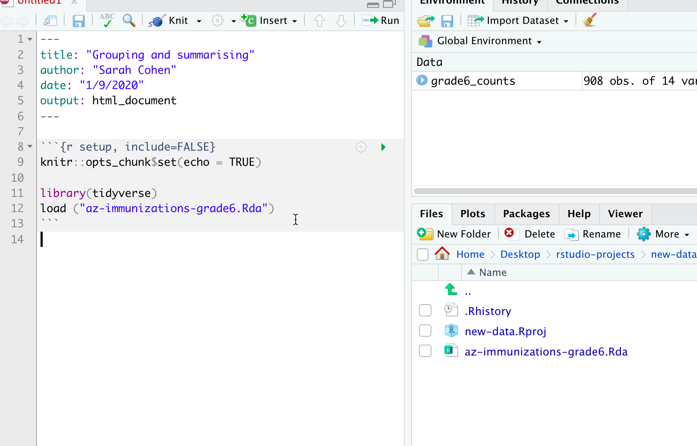

# Verbs Part 2: group_by and summarise


## Key takeaways

* `group_by` and `summarise` are the R equivalent to Excel's pivot tables
*  Together, they're usually used to answer questions like "how many?" and "how much?". 
*  You will rarely use `group_by` without `summarise`. 
* `group_by` is picky - it will create a separate answer for every variant of a category: "Lettuce" could be one, and "lettuce" could be another. 
*  Rolling up your totals to allow for percentage changes
*  Rearranging your data for easier reading with `pivot_wider` 


This continues with the Arizona immunization data from chapter 4 and assumes you've gone through that chapter. It uses some of the other verbs introduced there.  If you've started a new project, you can [re-download the data in R form](https://github.com/cronkitedata/rstudyguide/blob/master/data/az-immunizations-grade6.Rda?raw=true), and the load it in an R Markdown code chunk with this line:

    load("az-immunizations-grade6.Rda")
    
(Be sure to preface it with a subfolder name if you've saved it in one.)

When you run your first code chunk you should have a data frame called `grade6_counts` in your environment tab: 



## group_by / summarise^[The tidyverse uses the British spelling of a lot of words. You can use the American spelling, but you'll usually see it this way.] basics

Think of grouping as making piles of things while summarise counts, adds or creates other summary statistics.  

Where filtering and selecting let you hone in on individual items that meet specific criteria, grouping and summarising help you answer the questions of "how many?" and "how much?" They're the equivalent to pivot tables in Excel. 

Reporters use grouping to: 

* Focus further reporting on categories with particular characteristics, like neighborhoods with the most home loan rejections, or families who contributed the most to political candidates.
* Produce summary statistics for use in stories, such as the number of complaints by type of business or the number of c-sections by hospital or doctor.
* Test data they receive from government and others for errors, such as missing codes, impossible combinations, sudden and suspicious patterns or incorrect totals when checked against an independent source.

To refresh your memory, this query counts the number of schools and adds up the number of students by type of school while giving them descriptive names: 


```r
grade6_counts %>%
  group_by (school_type) %>%
  summarise ( schools = n() ,
              student = sum (enrolled, na.rm=TRUE)
      )
```

```
## `summarise()` ungrouping output (override with `.groups` argument)
```

Notice the `na.rm=TRUE` in the sum() function. You should almost always add this to any summary math function, like sum(), median(), mean(), etc. If you don't, a single missing value (`NA`) will result in an answer of `NA`. That's good practice and it makes sense: you should *want* to know if your data has missing or invalid information. But normally you have no choice but to ignore it.

### Other summary functions

Counting and summing are the most common, but you might also use these functions: 

Function | description
--- | --- 
n_distinct () | the number of unique values of the variable you name
median () , mean() | The median or mean of a numeric variable
min() , max()   | Just what it looks like

### Grouping by more than one variable

An example of counting by school type, and whether a school nurse is on staff: 


```r
grade6_counts %>%
  group_by ( school_type, school_nurse) %>% 
  summarise ( num_schools = n() ) 
```

```
## `summarise()` regrouping output by 'school_type' (override with `.groups` argument)
```

<div class="kable-table">

|school_type |school_nurse | num_schools|
|:-----------|:------------|-----------:|
|CHARTER     |NO           |         169|
|CHARTER     |YES          |          24|
|PRIVATE     |NO           |          32|
|PRIVATE     |YES          |          35|
|PUBLIC      |NO           |         240|
|PUBLIC      |YES          |         408|

</div>

It produces every combination of the school_type and school_nurse.

### Rolling up to the next level

If you wanted to know what percent of schools are charter, you'd need the total number of schools as a variable in your data frame. You can roll up to the next level this way: 


```r
grade6_counts %>% 
  group_by( school_type ) %>% 
  summarise (schools = n() ) %>% 
  mutate  ( total = sum( schools),
            pct_total = schools/ total * 100 ) %>%
  arrange ( desc (schools))
```

```
## `summarise()` ungrouping output (override with `.groups` argument)
```

<div class="kable-table">

|school_type | schools| total| pct_total|
|:-----------|-------:|-----:|---------:|
|PUBLIC      |     648|   908| 71.365639|
|CHARTER     |     193|   908| 21.255507|
|PRIVATE     |      67|   908|  7.378855|

</div>

#### A note on count() and tally() {-}

You may see other tutorials in which the group_by / summarise is shortened to use two other verbs, `tally()` and `count()`. They're perfectly good for a very quick review of the data, but it's a little hard to follow how they work. For now, sticking with the group_by / summarise sequence will help you cement it in your mind while at the same time making it closer to what you'll find in other programming languages. 

When you get further along, you'll notice that count() is really useful to isolate lines that could be duplicates. 

## Restructuring for a report with `pivot_wider()`

It's hard to read multi-level groupings, so the tidyverse offers a way to spread one variable across the top with the other down the side. This is just like dragging one column into the "Columns" area in a pivot table, and another into the "Rows".  Here is how you'd make a crosstab like those in Excel using this method: 


Here's a full example of creating "column" percentages and then showing them as a crosstab. See if you can piece together what's going on. If not, try moving pieces of the query outside the code chunk (and remove your ` %>%` operator) and run it piece by piece.  


```r
grade6_counts %>%
  group_by (school_type, school_nurse) %>%                           # See 1
  summarise ( schools = n() ) %>%
  mutate ( types = sum(schools),                                     # See 2
           pct_types = schools/types*100) %>%                        # See 3 
  select (school_type, school_nurse, pct_types) %>%
  pivot_wider ( names_from = school_type, values_from = pct_types)   #See 4
```

```
## `summarise()` regrouping output by 'school_type' (override with `.groups` argument)
```

<div class="kable-table">

|school_nurse |  CHARTER|  PRIVATE|   PUBLIC|
|:------------|--------:|--------:|--------:|
|NO           | 87.56477| 47.76119| 37.03704|
|YES          | 12.43523| 52.23881| 62.96296|

</div>

Now you have a crosstab showing that public schools are five times as likely to have a school nurse as charter schools (63/12), and private schools are in between.  Remember the rule:

> The independent variable, or the thing that comes first, is in your column and the thing that comes
second is in your rows. Then calculate the column percentage


Walking through this code: 

1. Do a usual group_by/summarise by the type of school and whether there are school nurses. The order matters, in order to get the right percentages. 
2. Calcuate the sum *at the next level*, which is by school type -- this is a hidden feature of group_by, in that it rolls up sequentially through the variables you have grouped on -- to get the total by school_nurse, then calcuate the percentage off of that.
3. Keep only the variables you want to see in the end. 
4. pivot it! 

### A note on restructuring your data frames

`pivot_wider` is part of a whole set of functions designed to work with tidy data, and fix untidy data. You'll sometimes see it called `spread`, which is from an older version of the tidyverse, and is harder to understand. We'll come back to some of this later on. 


## Resources & exercises


If you got through this, congratulations! You've mastered one of the things that people new to data analysis struggle find difficult to wrap their heads around. If you're still unsure, don't worry -- many people are. Maybe some of these resources will help:

* Mary Jo Webster's "[Intro to analysis with Tidyverse](https://mjwebster.github.io/DataJ/R/IntroAnalysisWithR.html)" is a walkthrough aimed at group by / summarise.
* Go back to [Pivot Tables in Excel](https://cronkitedata.github.io/cronkite-docs/excel/practice/12-excel-baseball) - it's the same thing. 
* Susan Baert's dplyr tutorial: [summarizing data](https://suzan.rbind.io/2018/04/dplyr-tutorial-4/)
* Matt Waite's "[Aggregates](http://mattwaite.github.io/sports/aggregates.html)" chapter

### Exercises

* Using one of the datasets you worked with in pivot tables, try to replicate at least some of your work in R. 


